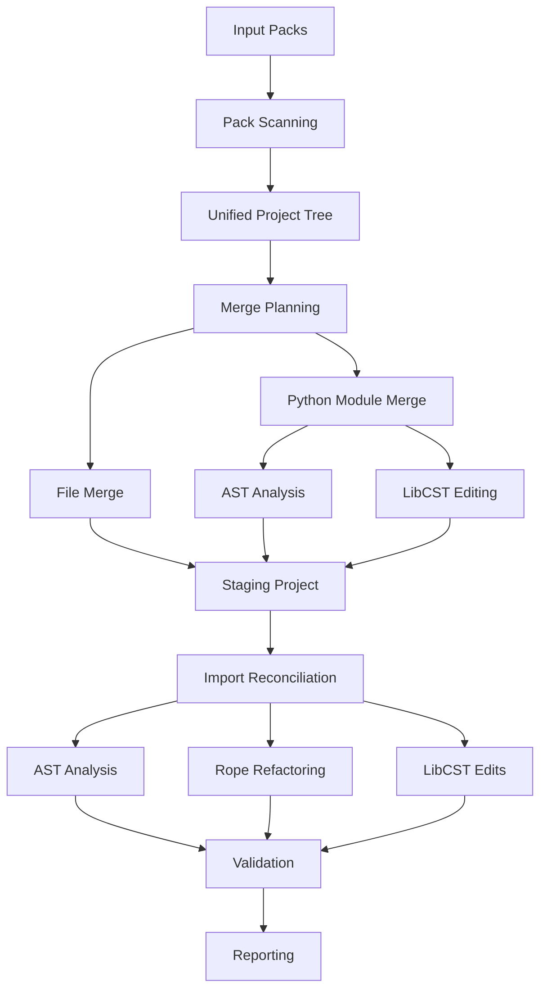
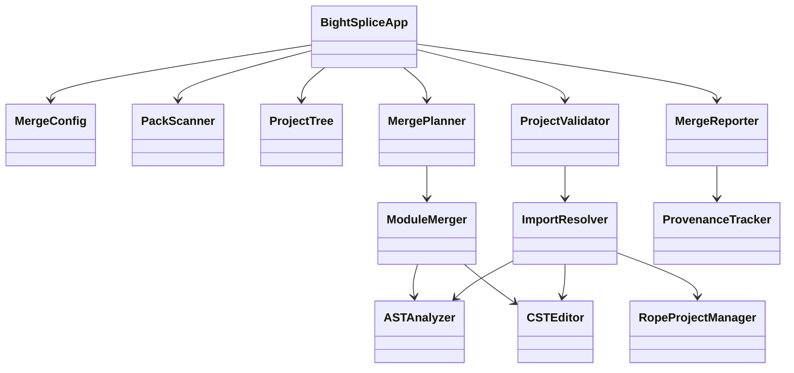
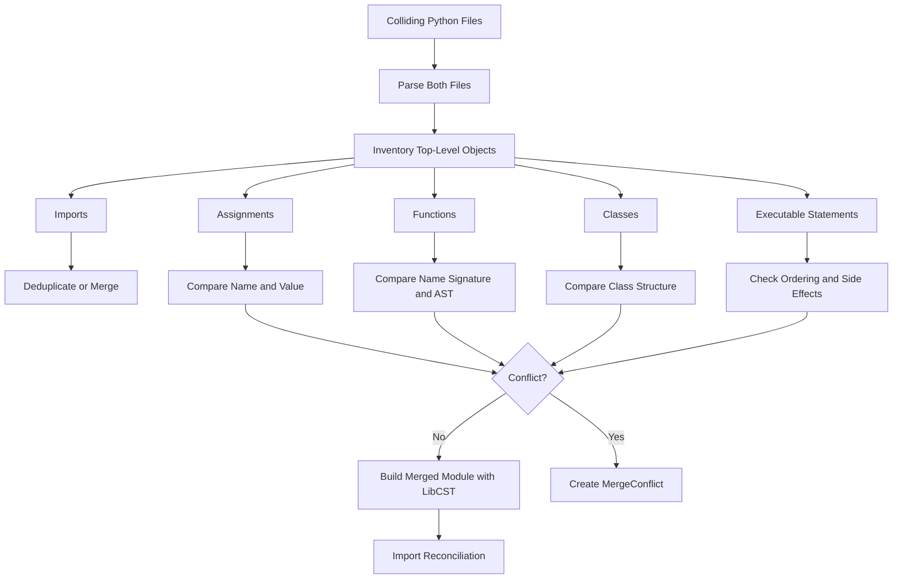
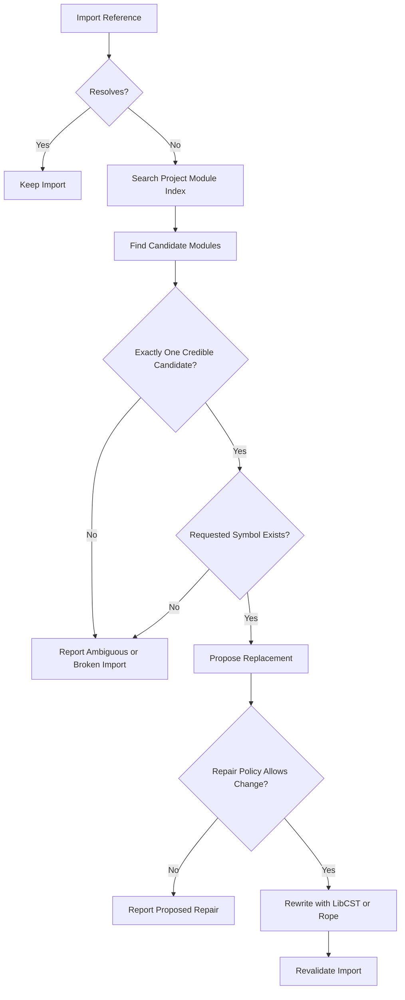
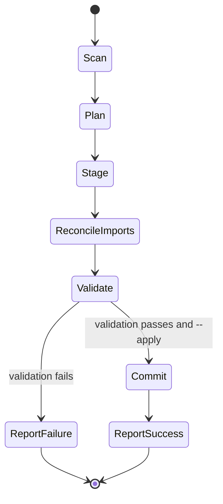
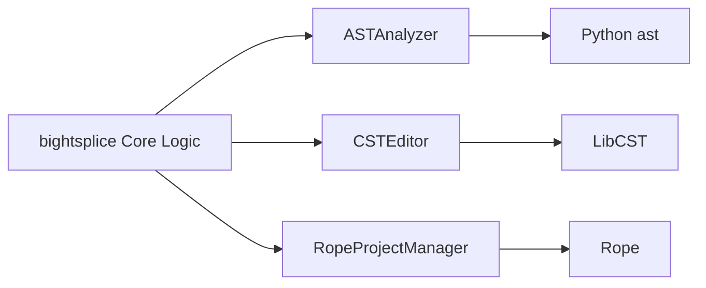

# AGENTS.md

## Project

`bightsplice` is a Python project reassembly and merge tool.

Its purpose is to reconstruct a complete Python project from two or more partial file packs, reconcile overlapping file trees, merge colliding Python source files where safe, and validate or repair Python imports after reconstruction.

The tool must favor correctness, traceability, and conservative automatic modification over aggressive guessing.

---

## Core Requirements

`bightsplice` must:

* Accept two or more project/file-pack source trees.
* Reconstruct a unified destination file tree.
* Preserve files that exist in only one source pack.
* Detect identical duplicate files and deduplicate them.
* Detect file-path collisions.
* Merge colliding Python files structurally where safe.
* Detect symbol-level conflicts inside colliding Python files.
* Preserve source provenance throughout the merge.
* Analyze Python imports across the reconstructed project.
* Validate relative and absolute imports.
* Detect imports that became invalid because modules were moved, renamed, or reorganized.
* Repair imports automatically only when the replacement can be determined with high confidence.
* Report ambiguous or unsafe repairs instead of guessing.
* Preserve comments and formatting when modifying Python source.
* Support dry-run operation before modifying the destination project.
* Produce a detailed merge and validation report.

---

## Python Version

Target Python:

```text
Python >= 3.11
```

Do not add compatibility code for older Python versions unless explicitly required.

---

## Required Libraries

Use the following technologies as complementary layers:

```text
rope>=1.14
libcst>=1.4
```

Python's built-in `ast` module is also a core implementation dependency.

### AST

Use Python `ast` for:

* syntax validation
* module inspection
* import discovery
* symbol discovery
* class/function/assignment inventory
* structural comparison
* structural hashes
* semantic checks that do not require source preservation

Do not use AST unparsing as the primary mechanism for rewriting project files.

Avoid workflows based on:

```python
ast.parse(...)
ast.unparse(...)
```

when the result would replace user source, because this can alter formatting and discard comments.

### LibCST

Use LibCST for source-preserving modifications.

LibCST should handle operations such as:

* adding imports
* removing imports
* replacing imports
* inserting definitions
* merging compatible definitions
* retaining comments
* retaining whitespace
* retaining formatting
* rendering modified Python modules

Whenever Python source must be rewritten, prefer LibCST unless there is a strong technical reason not to.

### Rope

Use Rope for project-aware refactoring.

Rope should handle or assist with:

* project/module resolution
* module moves
* module renames
* symbol renames
* updating references
* updating imports after project restructuring
* determining relationships between Python resources

Keep Rope integration behind a project adapter rather than coupling Rope directly into unrelated classes.

---

## Architecture

Keep responsibilities separated.



Do not collapse scanning, merging, import repair, and validation into one large class.

---

## Primary Components

### `MergeConfig`

Owns user/configuration inputs such as:

* source packs
* destination
* dry-run/apply mode
* collision policy
* import repair policy

### `PackScanner`

Responsible only for discovering and inventorying source files.

It should:

* recursively scan source packs
* ignore development/cache directories
* calculate file hashes
* classify Python files
* preserve relative paths
* identify source-pack provenance

It should not perform merge decisions.

### `ProjectTree`

Represents the combined logical project tree.

It should:

* collect all source candidates by destination path
* expose collisions
* distinguish unique files from duplicate or conflicting files
* provide the basis for module/package indexing

### `MergePlanner`

Determines what should happen to each destination path.

Typical classifications:

```text
COPY
DEDUPLICATE
MERGE_PYTHON
COLLISION
```

Planning should not modify files.

### `ASTAnalyzer`

Provides lightweight semantic analysis.

It should expose reusable operations for:

* parsing
* imports
* definitions
* assignments
* `__all__`
* symbol inventory
* structural comparison
* structural hashing

### `CSTEditor`

Owns source-preserving Python edits.

Do not scatter direct LibCST transformations throughout unrelated modules.

### `ModuleMerger`

This is a core `bightsplice` component.

It should:

* compare colliding Python modules
* classify top-level statements
* merge non-conflicting definitions
* deduplicate equivalent definitions
* detect conflicting definitions
* preserve source text using LibCST
* return conflicts rather than guessing

### `ImportResolver`

Responsible for determining whether imports are valid in the reconstructed project.

It should understand:

* absolute imports
* relative imports
* package-relative levels
* `__init__.py` exports
* namespace packages where practical
* imported symbols
* moved or renamed modules

### `RopeProjectManager`

Provide a narrow adapter around Rope.

It should own:

* project lifecycle
* resource lookup
* refactoring operations
* applying Rope changes
* validating Rope operations

Do not expose Rope objects broadly across the application unless necessary.

### `ProjectValidator`

Validation should occur after reconstruction and again after import repair.

Validation should include:

* Python syntax
* import resolution
* imported-symbol resolution where practical
* project compilation where practical
* unresolved collision detection

### `ProvenanceTracker`

Every merged result should retain sufficient information to determine where it came from.

Track at minimum:

* source pack
* source path
* destination path
* merged definitions
* import repairs
* conflict origins

### `MergeReporter`

Reporting should support human-readable output and machine-readable output.

At minimum support:

```text
text
json
```

---

## Component Relationships



---

## Python Collision Rules

Do not treat Python file collisions as simple text concatenation.

For colliding Python modules, classify top-level content into categories such as:

* imports
* assignments/constants
* functions
* async functions
* classes
* module metadata
* executable statements
* `if __name__ == "__main__"` blocks

### Merge Decision Flow



### Safe Merge

The following are generally safe to merge automatically:

* unique imports
* identical imports
* unique functions
* unique classes
* unique assignments
* structurally identical duplicate definitions

### Conflict

The following should normally be treated as conflicts:

* same symbol name with different function bodies
* same symbol name with incompatible signatures
* same class name with meaningfully different definitions
* same constant/assignment name with different values
* incompatible module initialization statements
* ambiguous ordering-dependent executable statements

Do not silently choose one conflicting definition unless an explicit collision policy requires it.

---

## Structural Comparison

AST structural comparison may be used to determine whether two Python definitions are semantically identical enough for deduplication.

Structural hashes should exclude source-position metadata such as:

* line number
* column
* end line
* end column

Comments and formatting are not part of semantic AST equality but must still be preserved when choosing the output source representation.

---

## Import Reconciliation

After the unified project tree is assembled, build a module/package index before attempting repairs.

For every import, determine:

1. Does the target module resolve?
2. Does the requested relative-import level resolve correctly?
3. Does the requested symbol appear to exist?
4. Did the original module move or get renamed?
5. Is there exactly one credible replacement?

Examples to support:

```python
from . import foo
from .foo import Bar
from ..foo import Bar
from package.foo import Bar
import package.foo
```

### Import Repair Flow



### Automatic Repair

Automatic import modification must be conservative.

A repair may be applied automatically when:

* the current import does not resolve
* a replacement module can be uniquely identified
* the requested symbol exists in the candidate target where applicable
* there is no credible competing candidate

### Ambiguous Repair

If multiple possible targets exist, report the issue instead of guessing.

Example:

```text
BROKEN IMPORT
source: package/router.py
line: 12
import: from .interfaces import Ethernet

possible targets:
    package.network.interfaces
    package.devices.interfaces

resolution: ambiguous
```

---

## Relative Imports

Relative-import correctness must be evaluated against the final reconstructed package hierarchy, not the source-pack hierarchy.

If a file's effective module location changes, recalculate the required relative import level.

Avoid converting relative imports to absolute imports automatically unless explicitly configured.

---

## Source Preservation

User source should be changed as little as possible.

Preserve wherever possible:

* comments
* formatting
* blank lines
* quoting style
* annotations
* decorator formatting
* import grouping
* source order

Do not reformat an entire file merely because one import changed.

---

## Dry Run

Dry-run should be the default behavior.

A dry run should:

* scan all packs
* build the unified tree
* identify collisions
* analyze Python modules
* determine proposed merges
* determine import repairs
* perform validation where possible
* produce a report

It must not alter the destination project.

Applying changes should require an explicit action such as:

```bash
bightsplice ... --apply
```

---

## Apply Flow



---

## Destination Safety

Never destructively overwrite a destination tree without explicit user intent.

When applying changes:

* write through a staging area where practical
* validate the staged project
* report failures before replacement
* avoid partial project updates where practical

---

## Non-Python Files

Non-Python collisions should not be merged semantically unless a dedicated handler exists.

Default handling:

* identical content: deduplicate
* different content: report collision

Optional policies may include:

```text
first
last
error
```

Do not silently overwrite differing non-Python files by default.

---

## Provenance

Provenance is a core requirement, not optional metadata.

For every resulting file, retain enough information to identify all contributing source packs.

For merged Python symbols, retain source information where practical.

Example conceptual record:

```json
{
  "destination": "package/network.py",
  "sources": [
    "pack-a/package/network.py",
    "pack-c/package/network.py"
  ],
  "merged_symbols": {
    "Ethernet": "pack-a",
    "VLAN": "pack-c"
  }
}
```

---

## Error Handling

Prefer explicit exceptions and structured conflict results.

Do not use broad exception swallowing such as:

```python
try:
    ...
except Exception:
    pass
```

If a recoverable parsing or merge failure occurs, record it in the merge report.

Unexpected failures should retain enough context to identify:

* source pack
* source file
* destination
* operation being attempted

---

## Coding Style

Use:

* type annotations
* `pathlib.Path`
* `dataclasses` where appropriate
* `Enum` / `StrEnum` for closed option sets
* small focused classes
* explicit return types
* deterministic ordering
* clear public/private method boundaries

Prefer:

```python
value != None
```

over:

```python
value is not None
```

when following existing project coding conventions.

Avoid unnecessary abstraction layers.

Do not build custom Python parsers when `ast`, LibCST, or Rope already provide the required functionality.

---

## Dependency Boundaries

Third-party libraries should be wrapped behind project-owned interfaces where practical.



Avoid allowing the entire codebase to depend directly on LibCST or Rope internals.

This makes library upgrades and implementation changes easier.

---

## Testing

Use `pytest`.

Tests should cover at minimum:

* scanning
* hashing
* ignored directories
* unique files
* identical collisions
* non-Python collisions
* Python collision detection
* symbol extraction
* import extraction
* relative-import resolution
* structural hashes
* duplicate symbol detection
* safe Python merges
* unsafe Python merges
* LibCST source preservation
* import repair
* ambiguous import repair
* namespace/package handling
* provenance tracking
* dry-run safety

Regression tests should be added for every merge/import bug discovered.

---

## Test Fixtures

Prefer small artificial project trees.

Example:

```text
pack-a/
└── package/
    ├── __init__.py
    └── network.py

pack-b/
└── package/
    ├── __init__.py
    └── network.py
```

Tests should make it immediately obvious what behavior is being validated.

For complex scenarios, place fixture projects under:

```text
tests/fixtures/
```

---

## Validation Before Completion

Before considering an implementation change complete:

1. Run the test suite.
2. Validate Python syntax.
3. Verify source-preserving edits.
4. Check for unintended formatting changes.
5. Review import-repair behavior.
6. Check ambiguous cases are reported rather than guessed.
7. Confirm dry-run performs no destination writes.
8. Perform a code review of the changed implementation.

---

## Reports

Reports should distinguish at least:

```text
ADDED
DEDUPLICATED
MERGED
IMPORT FIXED
BROKEN IMPORT
SYMBOL COLLISION
FILE COLLISION
VALIDATION ERROR
```

Reports should explain why an automatic decision was made.

Example:

```text
[IMPORT FIXED]
package/router/vlan.py:8

before:
    from ..interfaces.vlan import VLANOptions

after:
    from .interface.vlan import VLANOptions

reason:
    original module does not exist
    replacement module is unique
    requested symbol exists in replacement
```

---

## Design Principle

When choosing between:

```text
automatic but uncertain
```

and:

```text
reported but safe
```

choose the reported and safe behavior.

`bightsplice` should be capable of performing sophisticated automatic reconciliation, but it must never hide uncertainty from the user.
