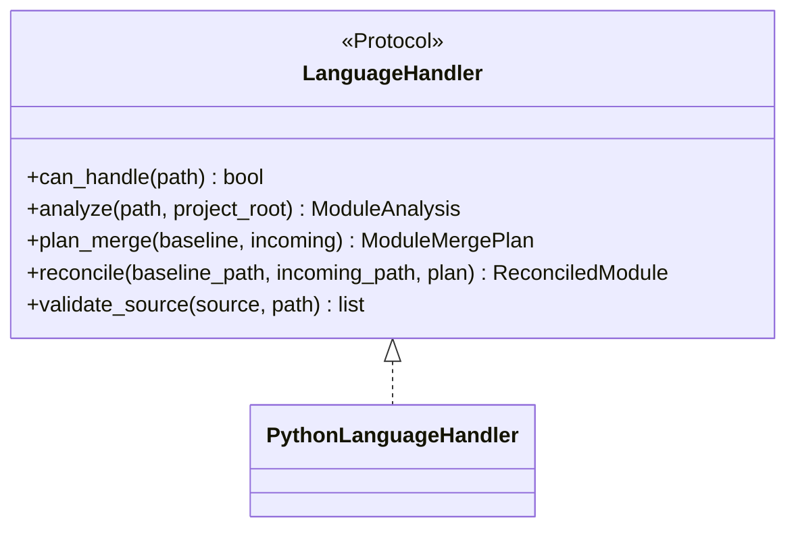
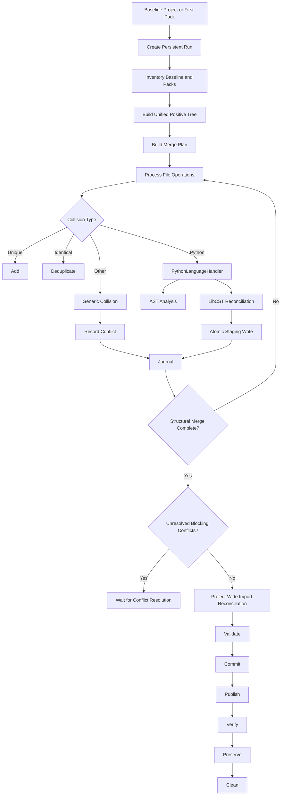
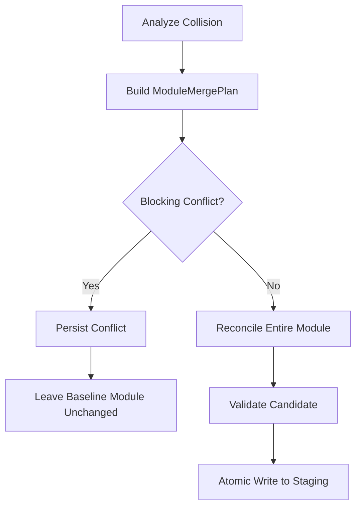
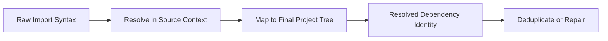
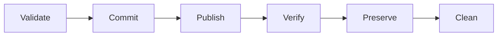

# AGENTS.md

## Project

`bightsplice` is a Python project reassembly and reconciliation tool.

It reconstructs a complete project from a baseline project tree and one or
more partial file packs. It combines file trees, reconciles Python source-file
collisions, repairs imports after the final project topology is known, tracks
all work in a resumable journal, and validates the completed merge before
publication.

The project favors correctness, traceability, source preservation, and
conservative automation over speculative fixes.

---

## Core Behavior

`bightsplice` must:

- Treat the currently exposed baseline tree as positive state.
- Preserve baseline files when an incoming pack has no corresponding file.
- Accept one or more incoming file packs.
- If no explicit baseline project exists, treat the first pack as the baseline.
- Ignore `.git/` completely during inventory, hashing, collision analysis,
  staging, and verification.
- Support configurable additional ignore/exclude patterns.
- Detect identical files and deduplicate them.
- Detect differing file collisions.
- Reconcile Python collisions structurally.
- Preserve comments, formatting, ordering, and local coding choices whenever
  possible.
- Defer project-wide import reconciliation until the complete staged tree is
  known.
- Track provenance.
- Use persistent, resumable runs.
- Treat the journal as the authoritative audit trail.
- Never apply a safe subset of a Python module merge when that module contains
  a blocking conflict.
- Allow unrelated merge operations to continue while conflicts are marked.
- Block publish while unresolved blocking or `MARK` conflicts remain.

---

## Language Handling

Use a generic language-handler boundary:



Version 1 implements only `PythonLanguageHandler`.

If language-aware processing is explicitly requested for an unsupported
language, raise `UnsupportedLanguageError`.

Ordinary non-Python collisions remain generic file collisions rather than
automatically raising an unsupported-language exception.

---

## Python Tooling Responsibilities

### Python `ast`

Use `ast` for:

- syntax parsing required by internal analysis
- import discovery
- symbol discovery
- class/function/assignment inventory
- structural comparison
- structural hashes
- lightweight semantic checks

Do not use `ast.unparse()` as the normal source-rewrite mechanism.

### LibCST

Use LibCST for source-preserving edits:

- import insertion/removal/replacement
- compatible import consolidation
- alias rewrites
- definition insertion
- metadata updates
- source rendering while preserving comments and formatting

### Rope

Use Rope for project-aware refactoring:

- module and symbol renames
- moves
- affected-reference discovery
- updating references caused by `bightsplice` refactors

Keep Rope behind a narrow adapter.

---

## Architecture



---

## Module Merge Rules

A Python module merge is atomic.



Classes and functions are atomic in version 1:

- structurally identical -> deduplicate
- same name, meaningfully different -> conflict

Assignments:

- identical -> deduplicate
- same name, different value/meaning -> conflict
- `__all__` receives special merge handling

Preserve baseline source order. Do not alphabetically reorder classes,
functions, or imports as part of reconciliation.

Preceding comments travel with the source block they describe.

---

## Import Reconciliation

Import reconciliation has two phases.

### Local merge-time import reconciliation

Within a colliding module:

- deduplicate equivalent imports
- combine compatible `from ... import ...` statements
- preserve baseline import order
- preserve aliases
- prefer a user's explicit alias over the full-length binding when safe
- use a weighted canonical-binding preference when multiple safe candidates
  exist
- never use weighting to override a semantic conflict
- two different explicit aliases for the same dependency require user choice
- an alias colliding with another module-level binding is blocking; suggest a
  safe alias but let the user decide
- preserve imports inside functions/classes
- preserve `TYPE_CHECKING` context
- preserve baseline comments and grouping
- merge `__future__` imports in the legal module-header position, after an
  optional module docstring

### Final project-wide reconciliation

Relative imports must be reevaluated against the final staged project tree
before deduplication or repair.

Do not treat raw relative levels as semantic identity.



Project-wide import repair begins only after all structural merges are known
and blocking conflicts are resolved.

---

## Star Imports

Support a configurable star-import policy.

When configured to prefer a star import, an explicit import from the same
module may be removed only if static analysis shows that the star import makes
that binding available. If `__all__` exists and omits the binding, keep the
explicit import.

When `bightsplice` removes an explicit import because of star-import
preference, add a concise explanatory source comment.

---

## Conflict Resolution

Conflicts are persistent first-class objects.

Before asking the user to resolve a conflict, allow inspection of the
conflicting source section.

Supported resolution actions include:

- `KEEP_BASELINE`
- `KEEP_INCOMING`
- `SELECT_ALIAS`
- `RENAME_INCOMING`
- `RENAME_BASELINE`
- `MANUAL_EDIT`
- `SKIP`
- `MARK`

`SKIP` means keep the baseline conflicting section, omit the incoming
conflicting contribution, and continue.

`MARK` leaves the conflict unresolved, allows unrelated work to continue, and
blocks publish until resolved.

A rename resolution must warn the user before execution that the affected merge
plan will be rebuilt.

### Manual edit

Prepare a conflict workspace containing:

```text
baseline.py
incoming.py
resolved.py
```

`resolved.py` should clearly mark baseline and incoming conflict regions, for
example:

```python
# <<< BEGIN BASELINE CONFLICT
...
# <<< END BASELINE CONFLICT

# >>> BEGIN INCOMING CONFLICT
...
# >>> END INCOMING CONFLICT
```

The user may delete, retain, combine, rename, or rewrite those sections.

Open `resolved.py` using:

1. explicitly configured editor
2. `$EDITOR`
3. print the file path if no editor is available

An XDG `text/plain` lookup may be added later.

Manual edits never directly overwrite staging. Validate the resolved source,
record its hash, reanalyze it, and rebuild the affected merge plan.

---

## Persistent Runs and Journal

Every merge is a persistent transaction.

Use:

```text
.bightsplice/
└── runs/
    └── <run-id>/
        ├── run.json
        ├── journal.jsonl
        ├── conflicts.json
        ├── resolutions.json
        ├── provenance.json
        ├── conflicts/
        └── staging/
```

The journal is the authoritative source of truth.

Every action, state transition, conflict, resolution, write, validation result,
recovery decision, publish action, and cleanup action must be journaled.

Use JSONL: one JSON object per line.

Use fixed-width hexadecimal numeric components in IDs, for example:

```text
op-0000002a
event-0000007f
conflict-00000003
resolution-00000003
```

IDs are unique within a run. The run ID provides the outer namespace.

Do not rely on filesystem timestamps for integrity decisions.

---

## Restart Modes

Support user-selectable restart behavior:

- `resume` — continue the same transaction; inputs/configuration must still
  match
- `recover` — replay the journal, verify staging, rebuild derived state, and
  replan changed inputs when permitted
- `restart` — preserve the old run and create a new run from current inputs

Support listing known runs, including at least:

- run ID
- status
- phase
- timestamps
- baseline project
- destination
- unresolved-conflict count

---

## Input Changes

A run is bound to the input state and effective configuration it was planned
against.

Use content hashes, not timestamps.

`.git/` is always excluded.

Do not create a separate input manifest unless implementation later proves one
necessary. The journal and run-state files should contain the source paths,
hashes, configuration, and other state required for resume/recovery.

Configuration changes are semantic input changes.

---

## Repeated Conflicts

Fingerprint conflicts using relevant semantic inputs.

After the same resolution has been selected for a configurable number of
identical conflicts, offer to apply it to matching conflicts.

Default threshold:

```text
3
```

Every bulk-applied resolution must still be journaled individually.

Historical conflict-resolution replay should default to asking the user before
reuse.

---

## Ignore / Exclude Rules

Always ignore:

```text
.git/
```

Provide configurable default/user ignore patterns.

Initial Python-oriented defaults may include:

```text
__pycache__/
.pytest_cache/
.mypy_cache/
.ruff_cache/
.tox/
.venv/
venv/
build/
dist/
*.egg-info/
```

Keep the mechanism generic enough for future environments such as
`node_modules/` or `.yarn/`.

Do not implement a custom `.gitignore` parser.

---

## Validation

Validation is about reconstructed-project integrity, not runtime-environment
completeness.

External dependency availability must not block publish.

Version 1 uses Flake8 with its normal/default rule behavior as the user-facing
source linting gate.

Use `ast` internally where needed for `bightsplice` analysis.

Do not import or execute project modules to validate them.

Validation checks:

- unresolved blocking/`MARK` conflicts
- lint sources with Flake8
- final internal import resolution
- internal symbol resolution where statically determinable
- consistency of Rope-assisted refactors initiated by `bightsplice`
- staged-tree integrity

Warnings are configurable. The default policy may fail validation on warnings.

A validation failure may be manually repaired in staging and revalidated. All
manual changes must be hash-tracked and journaled.

---

## Lifecycle Terminology

Use these terms consistently in code, CLI output, journal events, and docs:



`Commit` means freeze the validated `bightsplice` candidate. It does not mean a
Git commit.

---

## Git Behavior

The currently checked-out branch and exposed working tree at run start are the
authoritative baseline.

Do not require `main` or `master`.

If the active branch is not `main` or `master`, display an informational
notice only.

Never switch the user's active branch.

If Git-backed publishing is used, create a separate publish branch/worktree
based on the currently checked-out branch, reproduce the exposed baseline state
including uncommitted/untracked project files, then layer validated merge
changes on top.

Do not run `git add` or `git commit` automatically. After publish/verify, the
user decides whether to stage, commit, merge, discard, or otherwise manage the
Git result.

Git is supporting infrastructure; `bightsplice` remains responsible for merge
semantics.

---

## Positive Baseline Rule

Missing incoming files never imply deletion.

The published result is conceptually:

```text
baseline positive tree
+ accepted unique files
+ resolved collisions
+ reconciled Python modules
+ final import repairs
+ approved validation fixes
```

Baseline files persist unless an explicit merge/resolution action changes them.

---

## Publish and Verify

After validation:

1. `commit` freezes the validated staging candidate
2. `publish` copies/applies the candidate to the configured destination or
   Git-backed publish worktree
3. `verify` checks the published managed tree against the committed expected
   state using relative paths and hashes
4. `preserve` retains audit data
5. `clean` removes disposable successful-run data

Never clean staging before publish and verify succeed.

If publish or verify fails, preserve staging and diagnostics for
resume/recovery.

---

## Preserve and Clean

Keep completed-run audit data:

- journal
- run metadata
- provenance
- conflicts
- resolutions
- final hashes
- relevant diagnostics

Compress completed-run audit data by default with gzip.

Design configuration so additional compression methods can be added later.

After successful preserve, clean disposable successful-run data such as
staging and temporary publish artifacts.

Paused/failed staging data should remain available for diagnosis and recovery.

Support explicit run cleanup/deletion commands.

---

## Reporting

Reports should distinguish at least:

```text
ADDED
DEDUPLICATED
MERGED
IMPORT FIXED
BROKEN IMPORT
SYMBOL COLLISION
FILE COLLISION
VALIDATION ERROR
VALIDATION WARNING
MARKED CONFLICT
SKIPPED INCOMING
PUBLISH ERROR
VERIFY ERROR
```

Reports must explain automatic decisions.

---

## Coding Style

Use:

- Python >= 3.11
- type annotations
- `pathlib.Path`
- dataclasses where appropriate
- `Enum` / `StrEnum` for closed option sets
- deterministic ordering
- small focused classes
- explicit return types
- project-owned adapters around Rope and LibCST

Prefer:

```python
value != None
```

over:

```python
value is not None
```

when following project coding conventions.

Avoid broad exception swallowing.

---

## Testing

Use `pytest`.

At minimum test:

- inventory and ignore rules
- hashing
- positive-baseline behavior
- duplicate files
- generic collisions
- Python module analysis
- symbol deduplication/conflicts
- atomic module merge behavior
- import normalization
- alias preference/conflicts
- relative-import reevaluation
- `__future__` handling
- `TYPE_CHECKING`
- local imports
- star-import policy
- provenance
- journal replay
- resume/recover/restart
- input/config changes
- repeated conflict threshold behavior
- manual conflict workspace
- lint validation
- publish/verify lifecycle
- Git baseline behavior
- run preservation/compression/cleanup

Regression tests should be added for every discovered merge or recovery bug.

---

## Design Principle

When choosing between an automatic but uncertain action and a reported,
user-resolved action, prefer the reported and safe behavior.

`bightsplice` may perform sophisticated reconciliation, but it must never hide
uncertainty from the user.
