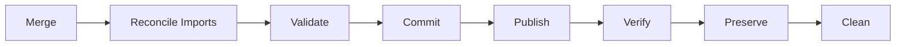

# bightsplice

`bightsplice` reconstructs a Python project from a baseline tree and one or
more partial file packs.

It combines file trees, reconciles Python source collisions, validates and
repairs imports against the completed project layout, tracks provenance, and
maintains a persistent resumable audit journal.

## Design goals

- Preserve the baseline project as positive state.
- Do not delete baseline files merely because a pack omits them.
- Use Python `ast` for semantic analysis.
- Use LibCST for source-preserving edits.
- Use Rope for project-aware refactors and reference updates.
- Delay project-wide import reconciliation until the complete staged tree is
  known.
- Treat Python module merges atomically when conflicts exist.
- Make all conflict decisions explicit and journaled.
- Support `resume`, `recover`, and `restart`.
- Validate before publish.
- Preserve audit data before cleanup.
- Keep Git mechanics in the background and never switch the user's active
  branch.

## Lifecycle



`Commit` here means freezing the validated `bightsplice` candidate. It does not
mean `git commit`.

## Core dependencies

```text
rope>=1.14
libcst>=1.4
flake8>=7
pytest>=8
```

## Conflict behavior

A blocking conflict prevents the affected Python module from being partially
merged. The baseline module stays unchanged until the conflict is resolved.

Users can inspect conflicts, select baseline/incoming definitions, choose
aliases, rename symbols, manually edit a prepared `resolved.py`, skip an
incoming conflict, or mark a conflict unresolved while allowing unrelated
merge work to continue.

## Git behavior

The currently checked-out branch and exposed working tree at the start of the
run are the baseline. `bightsplice` does not require `main` or `master` and does
not switch the user's branch.

When Git-backed publishing is used, a separate publish branch/worktree is
created from the currently checked-out branch. The exposed baseline state is
reproduced there and the validated merge is layered on top. `bightsplice` does
not automatically run `git add` or `git commit`.

## Run journal

Each run has an append-only `journal.jsonl` that is the authoritative audit
trail. Every action, conflict, resolution, write, validation result, recovery
decision, publish operation, and cleanup operation is journaled.

Operation and event identifiers use fixed-width hexadecimal numeric suffixes.

## Documentation

See:

- `AGENTS.md` — implementation and architecture contract
- `TODO.md` — intentionally deferred features
